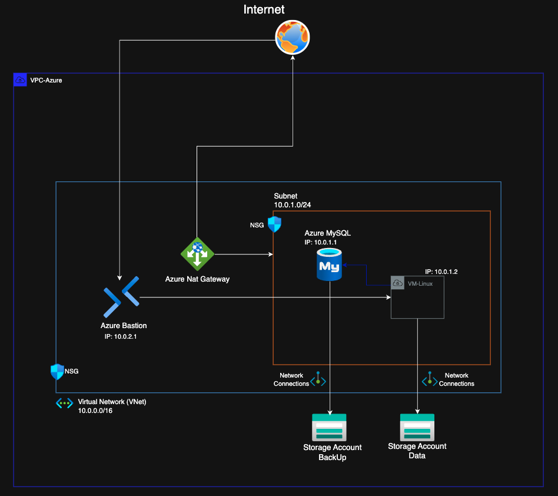
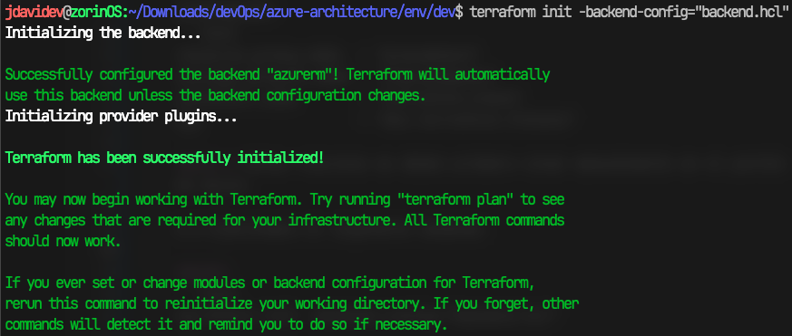

# Proyecto Azure-Architecture 

Proyecto practico para implemtentar todo el flujo CI/CD, con Terraform y GitHub Actions, el cual sera documentado completamente para comprender cada recurso implementado, desde la preparación del ambiente hasta cada detalle de uso de cada recurso.

1. Esquema propuesto para la practica.



2. Para esta practica utilizaremos GNU/Linux 🐧, donde instalaremos los recursos necesarios para el despliegue.

    2.1. **Instalación Azure-CLI**
    
    ***URL Azure***
    ```text
    https://learn.microsoft.com/es-es/cli/azure/install-azure-cli-linux?view=azure-cli-latest&pivots=apt
    ```
    2.2 Una vez instalado utlizamos el siguiente comando para realizar el login con nuestra cuenta de Azure
    
    *Bash*
    ```sh
    az login --use-device-code
    ```
    2.3. **Instalación Terraform**
    
    ***URL Terraform****
    ```text
    https://developer.hashicorp.com/terraform/tutorials/aws-get-started/install-cli
    ```

3. El proyecto se estructura de la siguiente manera:

    ```text
    ├── azure-architecture/
    │   ├── dev/
    │   ├── prod/
    │   └── stg/
    ├── modules/
    ```
4. Para cumplir con las buenas prácticas, configuraremos un backend remoto. De esta manera, el archivo ```.tfstate``` se almacena de forma segura y centralizada en Azure Storage

    4.1 Creamos un archivo de nombre ```provider.tf``` y colocamos la siguiente información:
    ```sh
    terraform {
      required_providers {
        azurerm = {
          source  = "hashicorp/azurerm"
          version = "4.69.0"
        }
      }

      backend "azurerm" {}
    }
    ```
    *Nota:* la versión del provedor requerido la tomamos de la documentación oficial de Terraform.
    
    4.2 Creamos un archivo de nombre ```backend.hcl``` el cual contiene la siguiente información:
    ```sh
    resource_group_name  = "graveweave"
    storage_account_name = "stgraveweave"                                
    container_name       = "terraform-state"              
    key                  = "dev.terraform.tfstate"
    ```
    *Nota:* Estos recursos se deben primero crear manualmente en el portal de Azure.

    4.3 Ejecutamos el siguiente comando:

    *bash*
    ```sh
    terraform init -backend-config="backend.hcl"
    ```
    Resultado:

    